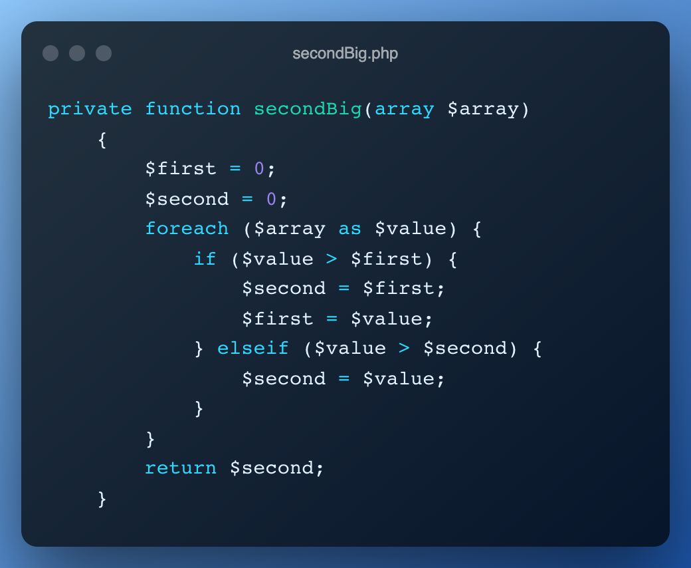

# TechnicalChallengeLean-SecondBig
Prueba Técnica lean-tech

Según un arreglo de números, se debe seleccionar el segundo número mayor:

```php
<?php
    secondBig([10, 40, 30, 20, 50]); //Resultado esperado ➞ 40
    secondBig([25, 143, 89, 13, 105]); //Resultado esperado ➞ 105
    secondBig([54, 23, 11, 17, 10, 21]); //Resultado esperado ➞ 23
    secondBig([84, 94, 23, 17, 10, 125]); //Resultado esperado ➞ 94
```

Para probar el Script, se debe ejecutar en su máquina la siguiente instrucción:
```bash
root@2685c3c4c2b6:/usr/src/app# php secondBig.php
**********************************
*     Resultado de la prueba     *
**********************************
Array: [10,40,30,20,50] => 40
Array: [25,143,89,13,105] => 105
Array: [54,23,11,17,10,21] => 23
Array: [84,94,23,17,10,125] => 94
root@2685c3c4c2b6:/usr/src/app#
```

## **Resultado de la función creada:**
